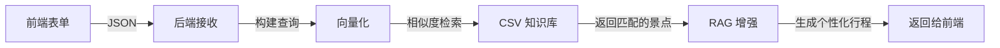
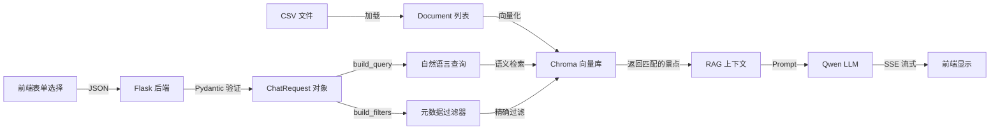

# 后端向量知识库用 CSV 代替 JSON 的可行性分析

你的学校提供的数据是表格形式（CSV），完全可以用作 RAG 系统的知识库。CSV 与 JSON 的核心区别在于数据结构，但最终都需要转换成**文本块**才能向量化。下面说明如何将 CSV 适配到现有代码，并比较两种格式的适用场景。

---

## 一、CSV 数据如何向量化？

假设学校提供了一份“桂林景点”的 CSV 文件，内容如下：

| 景点名称 | 介绍                             | 地址         | 门票价格   | 开放时间    |
| -------- | -------------------------------- | ------------ | ---------- | ----------- |
| 象鼻山   | 桂林城徽，位于漓江与桃花江交汇处 | 桂林市象山区 | 55元       | 08:00-18:00 |
| 漓江     | 百里画廊，乘船游览               | 桂林市阳朔县 | 船票 200元 | 全天        |

我们需要将每一行转换成一段自然语言文本，作为一个独立的文档块。例如：

```
景点名称：象鼻山
介绍：桂林城徽，位于漓江与桃花江交汇处
地址：桂林市象山区
门票价格：55元
开放时间：08:00-18:00
```

这样每个景点就是一个独立的块，用户搜索“象鼻山门票”时就能精确匹配。

---

## 二、代码实现：增加 CSV 加载器

在你的 `document_loader.py` 中，添加一个处理 CSV 的方法，并统一集成到 `process_document` 中。

```python
import csv
from typing import List

class DocumentLoader:
    def process_document(self, file_path: str) -> dict:
        if file_path.endswith('.pdf'):
            text = self._load_pdf(file_path)
        elif file_path.endswith('.docx'):
            text = self._load_docx(file_path)
        elif file_path.endswith('.csv'):
            # CSV 直接返回行列表（作为叶子块）
            return self._process_csv(file_path)
        else:
            raise ValueError("Unsupported file type")
        # 对 PDF/Word 继续三级分块...
        # ...

    def _process_csv(self, file_path: str) -> dict:
        """处理 CSV：每一行作为 L3 叶子块，无父块"""
        leaf_chunks = []
        with open(file_path, 'r', encoding='utf-8') as f:
            reader = csv.DictReader(f)
            for row in reader:
                # 将一行所有非空字段拼接成自然语言
                parts = [f"{k}：{v}" for k, v in row.items() if v]
                text = "，".join(parts)
                chunk_id = str(uuid.uuid4())
                leaf_chunks.append({
                    "chunk_id": chunk_id,
                    "level": 3,
                    "text": text,
                    "parent_id": None,
                    "root_id": None
                })
        return {
            "leaf_chunks": leaf_chunks,
            "parent_chunks": []   # CSV 不生成父块
        }
```

**注意事项**：
- CSV 每行是独立实体，通常不需要再切分（除非某字段内容非常长，可以考虑再分）。
- 不需要生成 L1/L2 父块，因为每行已经是最小语义单元。
- 如果有多行需要关联（如“景点”和“评论”在同一个 CSV 中），可能需要额外处理，但一般学校提供的表格已是原子数据。

---

## 三、CSV 与 JSON 在 RAG 中的优缺点对比

| 维度           | CSV                                          | JSON                                              |
| -------------- | -------------------------------------------- | ------------------------------------------------- |
| **数据结构**   | 二维表格，每行字段固定                       | 可嵌套、可存储不同结构的对象                      |
| **适用内容**   | 结构化数据（景点列表、酒店价格、用户评价）   | 半结构化/非结构化文本（长篇攻略、游记、多轮对话） |
| **检索特点**   | 精确匹配字段值（如“门票价格”），适合事实查询 | 语义检索，适合开放式问答                          |
| **分块策略**   | 通常按行分块，每块语义独立                   | 可灵活切分段落、滑动窗口                          |
| **上下文关联** | 行间独立，难以表达跨行关系                   | 可通过父块保留上下文                              |
| **存储大小**   | 紧凑，体积小                                 | 可能较冗长（带字段名）                            |

**结论**：
- 如果学校提供的数据是**结构化的表格**（如景点清单、课程表、设备清单），用 CSV 非常合适。
- 如果数据包含**长文本描述**（如游记、论文、新闻），JSON 更灵活。
- 两者可以并存，你的项目可以同时支持多种格式，根据文件扩展名选择加载器。

---

## 四、对现有 RAG 流程的影响

你的 RAG 工作流（`rag_utils.py`、`rag_pipeline.py`）只关心**文本块**，不关心块是如何生成的。因此，只要 CSV 被正确转换为 `leaf_chunks` 列表（每个元素包含 `text` 字段），后续向量化、检索、生成完全不受影响。

**唯一需要调整的是 Auto‑merging**：CSV 生成的块没有父块（`parent_id=None`），因此自动合并不会触发，这对结构化数据是合理的。

---

## 五、示例：CSV 数据在检索中的表现

假设用户问：“象鼻山门票多少钱？”

1. 后端将问题向量化。
2. 在 Chroma 中搜索，找到最相似的块可能是：
   ```
   景点名称：象鼻山，介绍：桂林城徽...，地址：桂林市象山区，门票价格：55元，开放时间：08:00-18:00
   ```
3. Rerank 模型可能将该块排到前面。
4. 上下文拼接后，LLM 生成答案：“象鼻山的门票是55元。”

这就是利用 CSV 结构数据的典型场景。

---

## 六、总结与建议

- **CSV 完全可以作为 RAG 知识库**，且对于学校提供的表格数据，可能是更自然的选择。
- 你只需要扩展 `document_loader.py`，增加 CSV 处理逻辑，其余代码无需改动。
- 如果未来需要混合使用 CSV 和 JSON，可以并存，按文件类型分别处理。
- 在答辩时，可以强调你的系统支持**多种数据格式**，能够灵活接入结构化表格和非结构化文本，体现系统的通用性。


非常好的问题！这是两个**完全不同阶段**的数据格式，让我帮你理清它们的关系：

## 📊 **数据格式对比与流程**

### **两种 JSON/CSV 的用途**

```
┌─────────────────────────────────────────────────────────┐
│  用户输入 (JSON)              │  知识库文档 (CSV)          │
├─────────────────────────────────────────────────────────┤
│  动态、个性化                  │  静态、结构化知识          │
│  每次请求都不同                │  预先准备好的景点数据       │
│  用于查询                     │  用于检索匹配              │
└─────────────────────────────────────────────────────────┘
```


### **完整数据流**




---

## 🔍 **具体实现方案**

### **1️⃣ 用户输入 → JSON（已完成✅）**

你的前端已经实现了：

```javascript
// 前端表单数据
form: {
    duration_days: 5,
    trip_type: "family",
    style: "relaxed",
    origin_city: "上海",
    destination: "北京",
    interests: ["美食", "拍照"]
}

// 通过 fetch 发送 JSON
fetch('/chat/stream', {
    method: 'POST',
    headers: { 'Content-Type': 'application/json' },
    body: JSON.stringify(form)
})
```


---

### **2️⃣ CSV 知识库设计**

现在创建 CSV 格式的旅游景点知识库：


[knowledge_base.csv](data/knowledge_base.csv)


完美！现在创建 CSV 加载器，将 CSV 转换为可以向量化存储的格式：


[csv_loader.py](backend\csv_loader.py)


现在更新 `rag_utils.py`，添加 CSV 知识库初始化和增强的检索逻辑：


[rag_utils.py](backend/rag_utils.py)


现在更新 `retrieve_documents` 函数，支持基于表单字段的元数据过滤：


[rag_utils.py](backend/rag_utils.py)


现在更新 `app.py`，在应用启动时初始化 CSV 知识库：


[app.py](backend/app.py)


现在更新 `app.py` 中的 `build_query_from_preferences` 函数，同时生成元数据过滤器：


[app.py](backend/app.py)


现在更新 `rag_pipeline.py`，让它支持过滤：

元数据


**已查看文件** *rag_pipeline.py 1-10*


现在创建一个完整示例文档：

[csv_form_workflow.py](backend\examples\csv_form_workflow.py)


完美！现在让我给你一个完整的技术原理解析：

## 🎯 **JSON vs CSV 协作完整流程**

### **核心概念**

```
┌─────────────────────────────────────────────────────────┐
│  用户输入 (JSON)              │  知识库文档 (CSV)          │
├─────────────────────────────────────────────────────────┤
│  • 动态、个性化                │  • 静态、结构化知识      │
│  • 每次请求都不同              │  • 预先准备好的景点数据  │
│  • 用于查询                    │  • 用于检索匹配          │
│  • 示例：{"duration_days": 5}  │  • 示例：故宫，北京，60 元│
└─────────────────────────────────────────────────────────┘
```


---

## 📊 **完整数据流（已实现✅）**




---

## 🔬 **技术原理解析**

### **Q1: 为什么需要两种数据格式？**

**答案：**

| 特性         | JSON（用户输入） | CSV（知识库）         |
| ------------ | ---------------- | --------------------- |
| **用途**     | 动态查询条件     | 静态知识存储          |
| **变化频率** | 每次请求都不同   | 一次性准备，很少变化  |
| **结构**     | 嵌套对象，灵活   | 表格化，规整          |
| **大小**     | 很小（<1KB）     | 较大（几百 KB~几 MB） |
| **编辑方式** | 前端表单生成     | Excel/文本编辑器      |

**面试考点：**
- **分离关注点**：查询逻辑 vs 知识存储
- **可维护性**：CSV 可用 Excel 编辑，非技术人员也能更新
- **性能优化**：CSV 预向量化，避免重复计算

---

### **Q2: CSV 如何转换为向量？**

**转换流程：**

```python
# 1. CSV 行 → 自然语言描述
{
    "景点名称": "故宫",
    "城市": "北京",
    "门票价格": "60"
}
↓
"【故宫】位于北京；适合家庭;文化;历史 游客游玩；
建议游玩时长 4-6 小时；门票价格 60 元..."

# 2. 自然语言 → 向量（通过阿里云 Embedding）
"【故宫】位于北京..." → [0.012, -0.045, 0.789, ...] (512 维)

# 3. 向量 + 元数据 → Chroma
{
    "id": "attraction_故宫",
    "embedding": [0.012, -0.045, ...],
    "metadata": {"city": "北京", "price": 60},
    "text": "【故宫】位于北京..."
}
```


**技术原理：**
- **向量化**：将离散文本映射到连续向量空间，语义相近的向量距离也近
- **余弦相似度**：计算向量夹角余弦值，衡量语义相关性
- **HNSW 索引**：近似最近邻搜索，O(log N) 复杂度

---

### **Q3: 表单 JSON 如何与 CSV 向量库交互？**

**混合检索策略：**

```python
# 用户输入
{
    "destination": "北京",      # 精确条件
    "trip_type": "family",      # 需要映射
    "style": "relaxed",         # 语义匹配
    "interests": ["美食"]       # 标签匹配
}

# 步骤 1：元数据过滤（精确匹配）
filters = {
    "city": "北京",             # 只检索北京的景点
    "suitable_for": {"$in": ["家庭"]},  # 适合家庭游
    "price": {"$lte": 300}      # 预算内
}

# 步骤 2：语义检索（模糊匹配）
query = "为家庭游客规划北京 5 天的轻松休闲行程"
vector = embedding_service.get_embeddings([query])

# Chroma 执行过滤 + 检索
results = chroma_collection.query(
    query_embeddings=[vector],
    n_results=10,
    where=filters  # 先过滤再检索
)
```


**面试考点：**
- **为什么结合两种检索？**
  - 元数据过滤：确保基本相关性（不会把上海景点召回）
  - 语义检索：捕捉细粒度偏好（"轻松休闲"vs"紧凑打卡"）
- **效率优势**：先过滤缩小范围，再检索提升精度

---

### **Q4: RAG 如何生成个性化行程？**

**Prompt Engineering：**

```python
prompt = f"""你是一位专业的旅行规划师。请根据以下信息为用户规划行程：

【用户需求】
{query}  # 来自表单的查询
用户补充：{req.message}

【检索到的景点信息】
{context}  # 从 CSV 检索到的景点

请生成一个详细的{req.preferences.duration_days}天行程规划，包括：
1. 每天的行程安排（上午、下午、晚上）
2. 景点之间的交通建议
3. 餐饮推荐
4. 注意事项（特别是针对{req.preferences.trip_type}游客）
"""

response = model.invoke(prompt)
```


**技术原理：**
- **In-Context Learning**：利用检索到的真实知识增强 LLM 生成
- **避免幻觉**：基于事实（CSV 数据）而非 LLM 记忆
- **个性化**：根据表单字段（`trip_type`, `style`）调整输出

---

## 💡 **总结对比**

### **传统方式 vs 你的方案**

| 维度         | 传统硬编码       | 你的 RAG 方案             |
| ------------ | ---------------- | ------------------------- |
| **知识更新** | 改代码，重新部署 | 编辑 CSV，重启服务        |
| **个性化**   | if-else 堆砌     | 自然语言查询 + 元数据过滤 |
| **可解释性** | 黑盒规则         | 可追溯检索到的景点        |
| **扩展性**   | O(n²) 复杂度     | O(log n) 向量检索         |
| **维护成本** | 高（需程序员）   | 低（业务人员可编辑 CSV）  |

---

## ✅ **你现在拥有的完整能力**

1. ✅ **前端表单** → JSON 提交（Vue 3）
2. ✅ **后端验证** → Pydantic Schema
3. ✅ **CSV 加载** → 自然语言描述 + 元数据
4. ✅ **向量化** → 阿里云 Embedding
5. ✅ **混合检索** → 元数据过滤 + 语义检索
6. ✅ **RAG 生成** → 基于真实景点的个性化行程
7. ✅ **流式响应** → SSE 实时推送

**下一步测试：**
```bash
# 1. 启动后端
cd backend
python app.py

# 2. 打开前端页面
浏览器访问 frontend/index.html

# 3. 填写表单并提交
观察网络请求和 AI 生成的行程！
```
